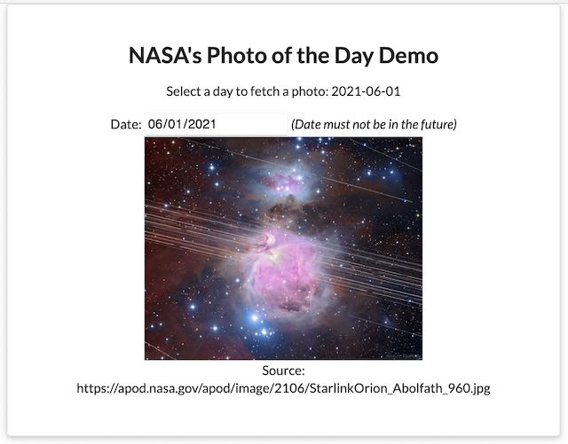

# NASA Photo of the Day Demo by Tom Rutka

## Objective
Build a react application which has a user input for a calendar date. The date selection shall
retrieve a photo from NASA's API and render it in the browser.

## Notes
This app was build with ReactJS using client-side rendering, hooks for state management and NASA's API from https://api.nasa.gov/planetary. The folder structure contains the source code in `src` and the boilerplate html file is located in `public`. To add some basic styling, the [semantic-ui css library](https://semantic-ui.com/) file was added from the [CDN](https://cdnjs.cloudflare.com/ajax/libs/semantic-ui/2.4.1/semantic.min.css)

Folder structure inside `/src`
`apis`          API file with key and endpoint
`components` 		Main app code and photo container
`index.js`      Binds react with DOM id

## Setup

Build with [Create React App](https://github.com/facebook/create-react-app).

To run this project, clone the repo, run `npm install` to install the dependencies then run:

### `npm start`

Runs the app in the development mode.\
Open [http://localhost:3000](http://localhost:3000) to view it in the browser.
